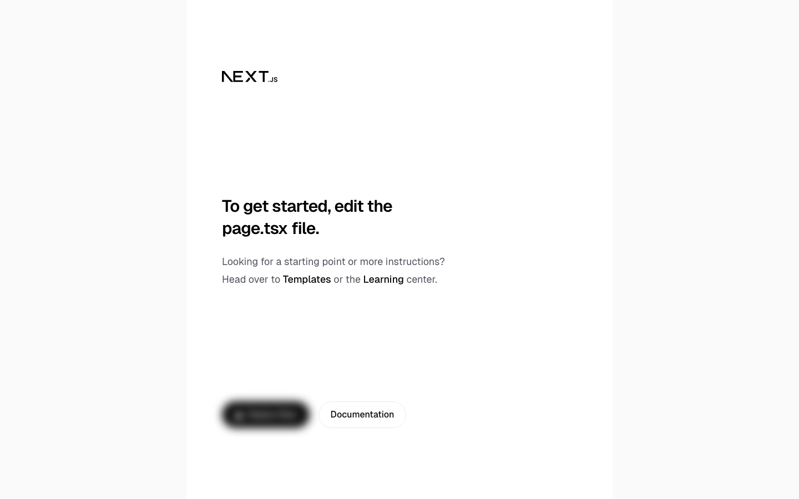
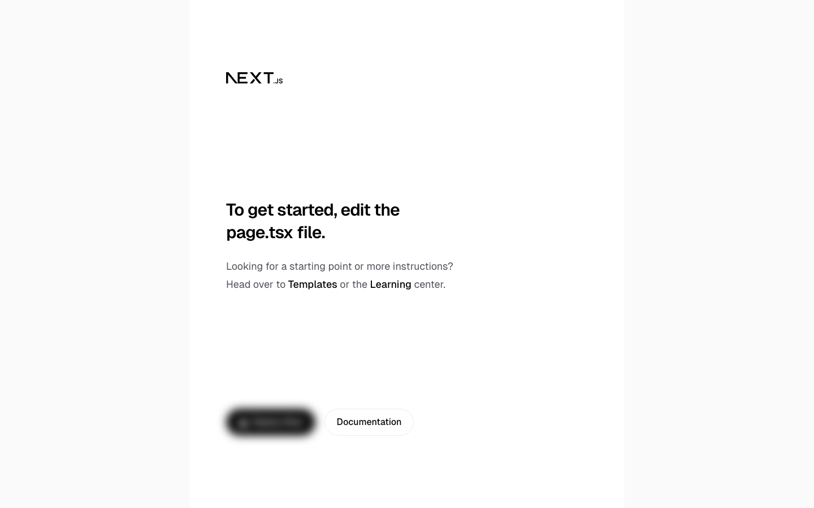
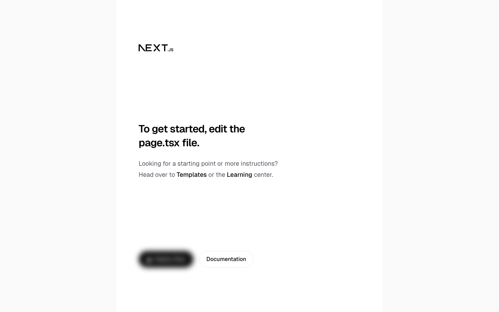
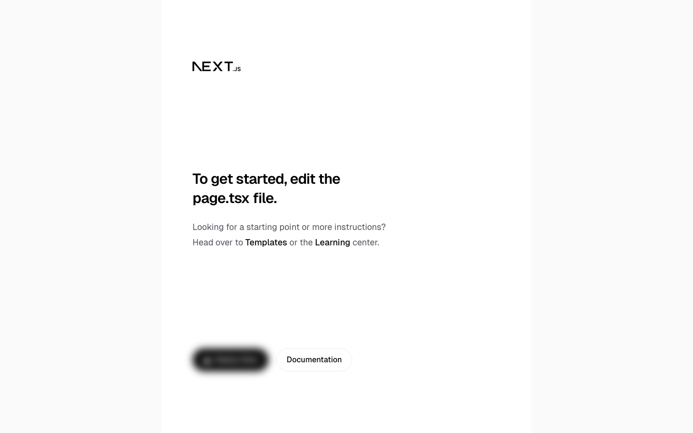
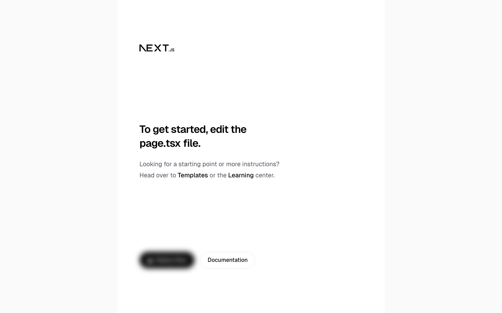
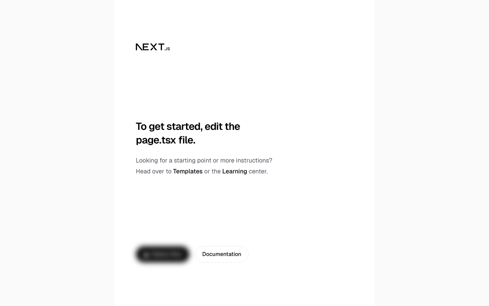
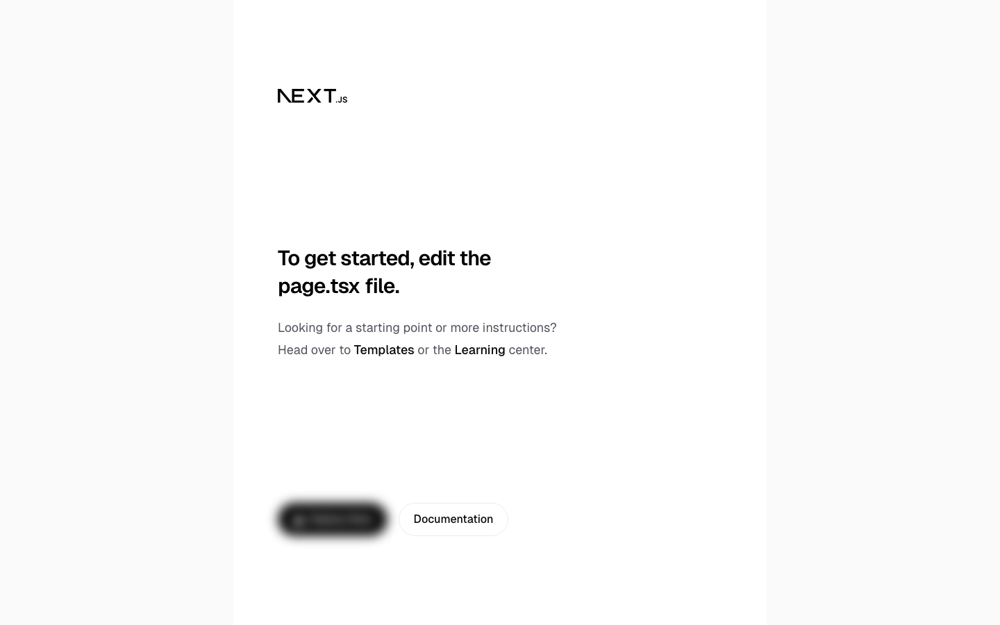
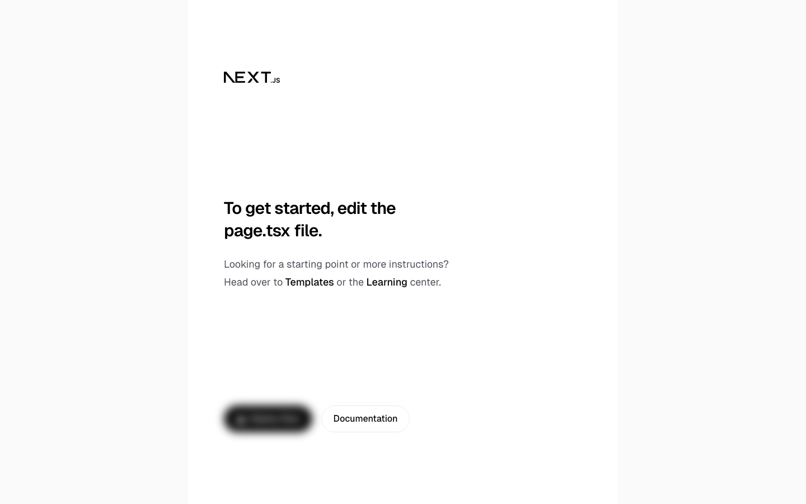

# cto-dash

[](LICENSE)
[](https://www.python.org/downloads/)
[](https://nodejs.org/)
[](https://nextjs.org/)
[](https://fastapi.tiangolo.com/)

A **fintech engineering command center** that aggregates signals from GitHub, Jira Cloud, Datadog/New Relic, cloud billing, compliance tools, and more — exposed via a unified MCP server and rendered in a Next.js dashboard.



## Stack

- **Frontend:** Next.js 15 (App Router), TypeScript, Tailwind CSS, shadcn/ui, Recharts
- **Backend API:** FastAPI (Python 3.11), SQLAlchemy, PostgreSQL
- **MCP Server:** Python MCP SDK exposing `health_check`, `sync_source`, and `get_metrics` tools
- **Cache / Jobs:** Redis + Celery
- **Local infrastructure:** Docker Compose (PostgreSQL + Redis + backend container)
- **Deployment:** Vercel (frontend) + Render/Railway/Fly.io (backend)

## Features

### Dashboard sections
- **Overview** — executive summary with uptime, payments, security, cost, and engineering flow scores
- **Engineering** — pull requests, commit velocity, DORA metrics, deployment frequency, lead time, MTTR
- **Product** — Jira sprint progress, story points, backlog health, delivery predictability
- **Operations** — active incidents, on-call rotation, P0/P1 tracking, incident lifecycle
- **Payments** — payment success rate, fraud/chargeback rates, transaction volume, settlement health, cost per transaction
- **Security** — CVE severity distribution, critical SLA tracking, secrets scanning findings, API gateway security
- **Compliance** — control pass/fail grid, audit log, PCI/SOC mappings, compliance manual upload
- **Cost** — MTD cloud spend, budget burn forecast, cost anomalies, top spend drivers
- **Team** — squad scorecards, developer productivity personas, resource allocation, bus-factor analysis

### Connectors & integrations
| Connector    | Required credentials                              | What it pulls                            |
|--------------|---------------------------------------------------|------------------------------------------|
| `github`     | `GITHUB_TOKEN`, `GITHUB_ORG`                      | Open PRs, Dependabot alerts, commits     |
| `jira`       | `JIRA_SERVER`, `JIRA_USERNAME`, `JIRA_API_TOKEN`, `JIRA_PROJECT_KEYS` | Sprints, issues, story points |
| `observability`| `OBSERVABILITY_PROVIDER` (`datadog` or `newrelic`) | Uptime, latency, error rate, transaction volume |
| `aws_cost`   | `AWS_ACCESS_KEY_ID`, `AWS_SECRET_ACCESS_KEY`      | Cloud spend, budget burn, cost drivers   |
| `jenkins`    | `JENKINS_URL`, `JENKINS_API_KEY`                  | CI pass rate, build durations            |
| `mixpanel`   | `MIXPANEL_API_KEY`, `MIXPANEL_API_SECRET`         | Product funnel and onboarding metrics    |

Real connectors fall back to realistic seed data when credentials are empty, so the dashboard is usable immediately.

### Additional capabilities
- **Live activity feed** via Server-Sent Events for incidents and alerts
- **Productivity personas** — per-developer signals across commits, reviews, delivery rate, and burnout risk
- **Sprint planning** — resource allocation, effective hours, leave days, dependencies, task-level detail
- **Export & reporting** — markdown/CSV summaries and PDF newsletter generation
- **MCP server** — query health, sync sources, and fetch metrics from any MCP client

## Screenshots

Developer and resource names are intentionally blurred in the screenshots below.

### Overview
Executive summary with uptime, payments, security, cost, and engineering flow scores.


### Engineering
Pull requests, commit velocity, DORA metrics, deployment frequency, lead time, and MTTR.



### Product
Jira sprint progress, story points, backlog health, and delivery predictability.


### Operations
Active incidents, on-call rotation, P0/P1 tracking, and incident lifecycle.



### Payments
Payment success rate, fraud/chargeback rates, transaction volume, settlement health, and cost per transaction.



### Security
CVE severity distribution, critical SLA tracking, secrets scanning findings, and API gateway security.



### Compliance
Control pass/fail grid, audit log, and PCI/SOC mappings.



### Cost
MTD cloud spend, budget burn forecast, cost anomalies, and top spend drivers.



### Team
Squad scorecards, developer productivity personas, resource allocation, and bus-factor analysis.



## Installation

### Prerequisites
- Python 3.11+
- Node.js 18+ with npm
- Docker & docker-compose (for local PostgreSQL + Redis)

### 1. Clone and configure

```bash
git clone <repo-url>
cd cto-dash
cp .env.example .env
```

Edit `.env` and fill in the credentials for the connectors you want to test. Leave a connector's fields empty to use seed data.

### 2. Start local infrastructure

```bash
docker-compose up -d
```

This starts PostgreSQL and Redis.

### 3. Start the backend

```bash
python -m venv .venv
source .venv/bin/activate
pip install -r backend/requirements.txt
uvicorn backend.api.main:app --reload --port 8000
```

The API auto-creates tables and seeds empty databases on startup. To force a reseed:

```bash
curl -X POST http://localhost:8000/seed?force=true
```

### 4. Start the frontend

```bash
cd frontend
npm install
npm run dev
```

Open [http://localhost:3000](http://localhost:3000).

### Production build check

```bash
# Frontend
cd frontend
npm run build

# Backend compile check
python -m compileall backend
```

### Optional: MCP server

```bash
python -m backend.mcp.server
```

### Optional: Celery worker

```bash
celery -A backend.tasks.celery worker --loglevel=info
```

## Configuration

Key environment variables:

| Variable | Purpose |
|----------|---------|
| `APP_ENV` | `development` or `production` |
| `SECRET_KEY` | Used for session/signing — generate a strong random value in production |
| `DATABASE_URL` | PostgreSQL connection string |
| `REDIS_URL` | Redis connection string |
| `ALLOWED_ORIGINS` | Comma-separated list of frontend origins for CORS (required in production) |
| `DATABASE_REQUIRE_SSL` | Set `true` when PostgreSQL enforces SSL |

See `.env.example` for the full list of connector settings.

## Documentation

- [Dashboard Plan](PLAN.md)
- [Architecture](docs/ARCHITECTURE.md)
- [MCP Connectors](docs/MCP.md)
- [Contributing](CONTRIBUTING.md)
- [Code of Conduct](CODE_OF_CONDUCT.md)
- [Security Policy](SECURITY.md)

## Maintainers

CTO Dash is maintained by Vineet Daniel and contributors.

## Git author

Configured for this repo as: `Vineet Daniel <vineetdaniel@gmail.com>`
